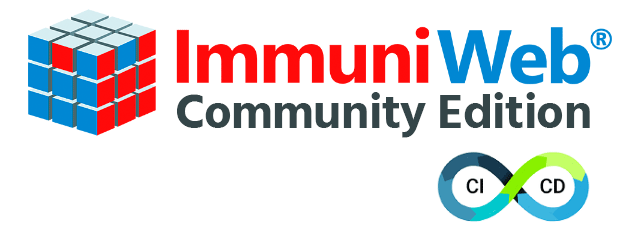

# iwtools — ImmuniWeb® Community Edition CLI

<p align="center">
  
</p>

Simple CLI interface to leverage [ImmuniWeb® Community Edition](https://www.immuniweb.com/free/) free tools in CI/CD pipelines and DevOps.

## Usage

### Website Security Test

Check your website for GDPR and PCI DSS compliance, test CMS and CSP security, verify web server hardening and privacy:

```sh
./iwtools.py websec https://www.immuniweb.com
```

#### Main features:

- GDPR & PCI DSS Test
- Website CMS Security Test
- CSP & HTTP Headers Check
- WordPress & Drupal Scanning

### Mobile App Security Test

Audit your iOS or Android apps for OWASP Mobile Top 10 and other vulnerabilities:

Local mobile app check:

```sh
./iwtools.py mobile /home/user/myapp/build/myapp.apk
```

Remote mobile app check:

```sh
./iwtools.py mobile https://ovel.space/download/myapp.apk
```

Published mobile app check:

```sh
./iwtools.py mobile https://play.google.com/store/apps/details?id=com.app.my
```

#### Main features:

- iOS/Android Security Test
- OWASP Mobile Top 10 Test
- Mobile App Privacy Check
- Static & Dynamic Mobile Scan

### Dark Web Exposure Test

Monitor and detect your Dark Web exposure, phishing and domain squatting:

```sh
./iwtools.py darkweb https://www.immuniweb.com
```

#### Main features:

- Dark Web Exposure Monitoring
- Phishing Detection and Monitoring
- Domain Squatting Monitoring
- Trademark Infringement Monitoring

### SSL Security Test

Test your servers for security and compliance with PCI DSS, HIPAA & NIST:

Web Server check:

```sh
./iwtools.py ssl immuniweb.com
```

Mail Server check:

```sh
./iwtools.py ssl immuniweb.com:25
```

#### Main features:

- Web Server SSL Test
- Email Server SSL Test
- SSL Certificate Test
- PCI DSS, HIPAA & NIST Test

Commandline options: [Wiki](https://github.com/immuniweb/iwtools/wiki/)  
Read more: [ImmuniWeb® Community Edition](https://www.immuniweb.com/free/)

This software is provided "as is" without any warranty of any kind.
By using this software you agree to the Terms of Service: https://www.immuniweb.com/pages/legal.html
By using this software you accept the Privacy Policy: https://www.immuniweb.com/pages/privacy.html
